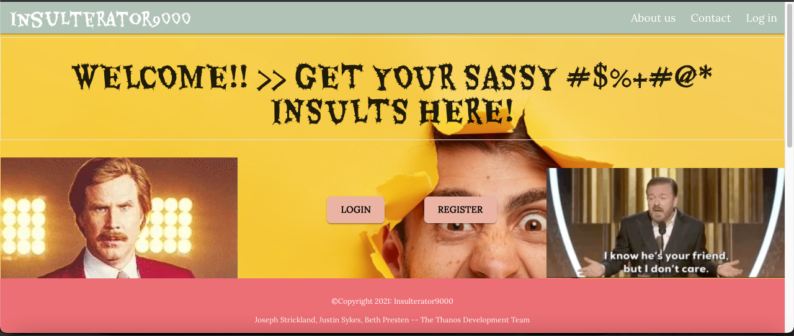

# Insulterator 9000

## Description

Don’t you want to just have a laugh? Need something to break the monotony of life that is silly and sometimes might not make sense? Introducing, THE INSULTERATOR 9000! An app designed to give you insults that aren't meant to be serious, but are also relevant to you! With our app, you have the ability to update your profile so insults are tailored to who you are, and what you’re into! Be prepared to roll on the floor laughing at the ridiculousness generated by our app! Be prepared to be “Insulterated”!

- [Design](#Design)
- [Installation](#installation)
- [Usage](#usage)
- [License](#license)
- [Contributions](#contributions)
- [Tests](#test)
- [Questions](#questions)

## Design

Fullstack MERN web application that utilizes a MVC design pattern with 3rd party API integration. User authentication with a hashed password and protected routes are utilized to provide site security.

## Installation

1. Access the main branch of the github repo and clone to your local folder to install app: https://github.com/bethpresten/insulterator9000.
2. Navigate to app. folder on local and run 'NPM INSTALL' in the CLI.
3. Heroku was used for app cloud hosting with Atlas DB plug-in to manage MongoDB alongside app in Heroku. You will need to sign-up for a free account and manually setup a Heroku instance for app deployment. Atlas DB plug-in addition and configuration is required as well.
4. When ready to publish to Heroku, in the root directory execute "NPM RUN BUILD" in CLI to allow React build and optimization for cloud deployment. Then execute "HEROKU DEPLOY" to push to your Heroku cloud instance.
5. Navigate to the newly deployed app in your browser to validate deployment and functionality.

## Usage

1. Access deployed app here: https://warm-anchorage-65464.herokuapp.com/#/
2. If using for the first time, navigate to Login screen then 'Register'. Complete user registration and then click on 'Finish Registration". App. will then complete login and re-direct to the user dashboard.
3. If already registered, simply navigate to the Login screen and enter your user email and password. You will be re-directed to the user dashboard.
4. From the dashboard, you can either update your profile or go ahead and get insulted!
5. On update profile page, you can update your occupation, hobby, or favorite sport. When finished click 'uopdate profile'. Optionally, you delete your profile or log out from the app as well.
6. On the insult results page, an insult based on your profile (occupation, hobby, favorite sport) and a randomly selected template will be displayed. If you really like the insult and would like share, an option is available to push it to Twitter or Facebook. Additionally, if you would like another one simply click 'generate insult'. When finished you can logout or go back to the dashboard page.

## License

MIT

Copyright (c) [2021] Justin Sykes, Beth Presten, Joseph Strickland

Permission is hereby granted, free of charge, to any person obtaining a copy
of this software and associated documentation files (the "Software"), to deal
in the Software without restriction, including without limitation the rights
to use, copy, modify, merge, publish, distribute, sublicense, and/or sell
copies of the Software, and to permit persons to whom the Software is
furnished to do so, subject to the following conditions:

The above copyright notice and this permission notice shall be included in all
copies or substantial portions of the Software.

THE SOFTWARE IS PROVIDED "AS IS", WITHOUT WARRANTY OF ANY KIND, EXPRESS OR
IMPLIED, INCLUDING BUT NOT LIMITED TO THE WARRANTIES OF MERCHANTABILITY,
FITNESS FOR A PARTICULAR PURPOSE AND NONINFRINGEMENT. IN NO EVENT SHALL THE
AUTHORS OR COPYRIGHT HOLDERS BE LIABLE FOR ANY CLAIM, DAMAGES OR OTHER
LIABILITY, WHETHER IN AN ACTION OF CONTRACT, TORT OR OTHERWISE, ARISING FROM,
OUT OF OR IN CONNECTION WITH THE SOFTWARE OR THE USE OR OTHER DEALINGS IN THE
SOFTWARE.

## Contributions & Technologies

- React library
- Materialize CSS framework
- Node JS runtime
- MongoDB
- Express servers
- NPM packages: react-share, b-crypt, bad-Words, node Fetch, concurrently, in-env, axios, mongoose

## Tests

None

## Questions?

Please reach out to us:

- Justin Sykes,
  GitHub username: 204039643,
  Email: atlsykes1@att.net
- Beth Presten,
  GitHub username: bethpresten,
  Email: bethpresten@gmail.com
- Joseph Strickland,
  GitHub username: jks2090,
  Email: jks2090@outlook.com

---This README was generated using nice-readme-generator :-) ---
